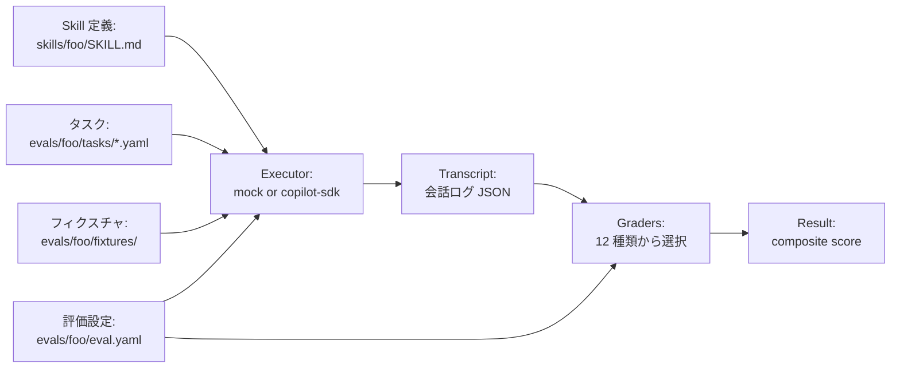
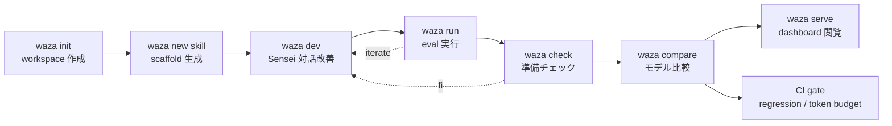

# Waza ── AI エージェント Skill を「テスト可能」にする評価プラットフォーム

> テクノ場 発表記事 / 想定読了 30 分 (コード飛ばし読み時) ・ 45 分 (精読) / 想定読者: AI agent skill や MCP server を実際に書いている (あるいは書こうとしている) ソフトウェアエンジニア

---

## はじめに

`microsoft/skills` リポジトリには 132 個以上の skill が登録されているのだが、その新規 PR を眺めていると、毎回似た議論が繰り返されている。

「この `description` は短すぎないか」「`USE FOR:` と `DO NOT USE FOR:` の境界が曖昧では」「Claude では発火するのに GPT-4o では別 skill が発火している。これ本当に普遍的に動くのか」「`SKILL.md` が長くなりすぎて、コンテキスト枠を圧迫していないか」── レビュアーが手作業で確認するしかなく、各レビュアーの判定基準も少しずつ違う。Skill 作者からしても、PR を出してから「やり直し」を食らうコストが大きい。

これは個別レビュアーの厳格さの問題ではなく、構造的な問題である。`go test` も `cargo bench` も `pytest -k` も持たない状態で、本番コードと等価な品質のものを世に出そうとしているからだ。コードに対しては当然備わっている「テスト可能性」「ベンチマーク可能性」「lint 可能性」が、Skill 開発の側にはまだ備わっていない。

本記事では、その空白を埋める Microsoft 製の OSS、**Waza** (技 ── Japanese for "skill/technique") を扱う。Go 1 バイナリで、Skill の scaffold・対話的改善ループ・モデル横断評価・トークン予算検査・A/B 効果測定・CI ゲートまで、Skill 開発の "工程" を全部 1 本にまとめている。

公式リポジトリは [microsoft/waza](https://github.com/microsoft/waza)、ドキュメントは [microsoft.github.io/waza](https://microsoft.github.io/waza/)、本記事の執筆時点バージョンは v0.34.0。ライセンスは MIT。

本記事は次の 3 部構成で進める:

- **Why** ── Skill 開発に「テスト可能性」が欠けている 4 つの構造的問題
- **What** ── Waza のメンタルモデルとプリミティブ
- **How** ── 個人・チーム・組織の各レベルで使う 7 ユースケース

---

## Why ── なぜ Waza が必要なのか

Skill 開発の現場で生じている痛みを、4 つに分解する。Waza が提供するすべての機能は、このどれかに対する応答である。

### 1. 規約準拠の検証が属人化している

`SKILL.md` には事実上の規約が存在する。「`description` は何文字以上であるべきか」「`USE FOR:` セクションを書くべきか」「動詞句で書き始めるべきか、名詞句で書き始めるべきか」── これらは `microsoft/skills` のコントリビューションガイドで言語化されている。だが、その規約が満たされているかを **機械可読な採点基準** として走らせる手段が、長らく存在しなかった。

結果、レビュアーは PR ごとに `SKILL.md` を読み下して「ここが基準に達していない」と毎回コメントを残すことになる。同じ skill でも、レビュアーごとに「Low と判定するか Medium と判定するか」が揺れる。

Skill 作者の側から見ても、「自分の skill が High 水準なのか Medium 水準なのか、PR を出すまで分からない」という不安がある。これが Skill 作者の参入障壁になる。

Waza はこの問題に対して、`Sensei` という採点基準に基づく compliance scorer を内蔵し、`Low / Medium / Medium-High / High` の 4 段階で機械的に採点する仕組みで答える。

### 2. トリガー精度のテストが体系化されていない

Skill には固有の難しさがある。**起動条件 (trigger) のテスト** だ。

通常のコードでは「呼ぶ側」と「呼ばれる側」の関係が明示的だが、Skill は LLM の routing 機構によって自動選択される。つまり、`description` や `USE FOR:` の文面によって "発火するか / しないか" が決まる。これは確率的かつモデル依存的で、`SKILL.md` を 1 単語書き換えただけで「Claude では発火するが GPT-4o では別 skill が選ばれる」みたいな現象が起こる。

ところが既存の評価フレームワーク (OpenAI Evals, LangChain の評価ツール群など) は基本的に「呼ばれた前提でのアウトプット品質」を測る設計になっており、「そもそも呼ばれるべきプロンプトで呼ばれているか」「呼ばれてはいけないプロンプトでは黙っているか」を構造的に検証する仕組みが弱い。

Skill 開発者は、結局のところ `microsoft/skills` の主 Skill だけでなく、近接する複数の Skill との競合関係を意識して書かないといけない。それを毎回手動で「Claude Code に多様な表現のプロンプトを投げ、自分の skill が想定どおり活性化するか、競合する別の skill が代わりに選ばれてしまわないかを 1 件ずつ目視確認する」のは持続不能である。

Waza はこの問題に対して、`trigger_tests.yaml` という専用の DSL と、`trigger` および `skill_invocation` という活性化テスト専用のグレーダーで答える。

### 3. モデル横断の評価が個別作業になっている

GPT-4o で動いた Skill が Claude Sonnet では動かない、その逆もある。`description` の解釈、`USE FOR:` 表現の重み付け、tool call の好み、`reference` ドキュメントへの追従性 ── どれもモデルごとに微妙に違う。

それを系統的に検出する手段がないと、Skill 作者は「自分が使っている 1 モデルでだけ動く Skill」を量産してしまう。`microsoft/skills` のように複数のモデル・複数のエージェントから利用される前提のリポジトリでは、これは致命的になる。

「同じ eval を `gpt-4o` と `claude-sonnet-4` で順番に走らせ、結果を Excel に貼って差分を取る」── 確かにできるが、現実的に誰もやらない。やったとしても、`SKILL.md` を 1 行直すたびにリピートできない。

Waza はこの問題に対して、`--model` を複数指定できる `waza run` と、結果を JSON 同士で差し引きする `waza compare` で答える。

### 4. トークン予算と CI ゲートが繋がっていない

`SKILL.md` には目に見えない「予算」がある。LLM のコンテキスト枠は有限で、Skill 群を `description` まで含めて事前ロードする方式が標準である以上、各 Skill のサイズはエージェントが扱える複雑性に直接効いてくる。`microsoft/skills` ではこの予算が **`SKILL.md` 500 token, `references/*.md` 1,000 token** のような数値ガイドラインとして存在している。

だがガイドラインが存在することと、それを CI で構造的に守らせることは別の話である。実際には `SKILL.md` が膨らみがちで、レビューのタイミングで「ちょっと長いですね」と指摘されて削るのが関の山だった。さらに厄介なのは、**回帰検出**。一度小さく書いた `SKILL.md` が、メンテナンスのうちに「修正のたびに 50 token ずつ増えて、半年後には倍になっている」みたいな膨張を起こす。

Waza はこの問題に対して、`.waza.yaml` で宣言的に予算を定義し、`waza tokens check` および `waza tokens compare main` で main からの増分を CI ゲートにかける仕組みで答える。

### 補足: Waza が解こうとしている 4 つの空白

ここまでの 4 痛みを、Waza のサブシステムと対応づけて整理しておく。以降の本文ではこの語彙を使う。

| 痛みポイント | Waza のサブシステム | 主なコマンド |
|---|---|---|
| 規約準拠の属人化 | Sensei compliance scorer | `waza dev`, `waza check` |
| トリガー精度のテスト不在 | Trigger / Skill invocation graders | `trigger_tests.yaml`, `trigger` grader |
| モデル横断評価の個別化 | Multi-model executor + comparison | `waza run --model`, `waza compare` |
| トークン予算と CI の分離 | Token budget enforcement | `.waza.yaml`, `waza tokens check` |

---

## What ── Waza とは何か

### 1. 一行で言うと

Waza は、AI エージェント Skill のための **`go test` + `go bench` + lint を 1 バイナリにまとめた Go 製 CLI** である。Skill の scaffold から、対話的改善ループ、モデル横断評価、A/B 効果測定、CI ゲートまでをカバーする。

ポイントは「Skill 専用に作られている」こと。汎用評価フレームワークではなく、`microsoft/skills` のディレクトリ規約や `SKILL.md` の frontmatter 規約に忠実に作られている。`waza new skill foo` が吐く scaffold は、そのまま `microsoft/skills` に PR を投げられる構造になっている。

### 2. メンタルモデル

Waza のメンタルモデルは、2 つの分離に支えられている。

**Skill 定義** と **評価設定** の分離。`skills/foo/SKILL.md` が "Skill そのもの" であり、`evals/foo/eval.yaml` が "それをテストする設定" である。両者は別ディレクトリに置かれ、別ファイルで管理される。これは `microsoft/skills` の構造と完全に一致しているので、Waza で開発した Skill はそのまま PR を投げられるし、PR をクローンしてきた Skill はそのまま `waza run` で評価できる。

そしてもうひとつ、**実行器 (executor)** と **採点器 (grader)** の分離。執行は `mock` (決定的・無料) と `copilot-sdk` (実モデル呼び出し) を切り替えられる。採点は 12 種類のグレーダーから選んで組み合わせる。同じ Skill を、開発初期は `mock` + `code` grader で速く回し、本番前は `copilot-sdk` + `prompt` grader で深く検証する、というスイッチが効く。



### 3. プリミティブ / 構成要素

Waza が扱う最小単位は次の 7 個である。

| プリミティブ | 役割 | 物理的な場所 |
|---|---|---|
| **Skill** | "何をする agent capability か" の定義 | `skills/<name>/SKILL.md` |
| **Eval** | 1 つの Skill に対する評価設定 | `evals/<name>/eval.yaml` |
| **Task** | 評価の 1 ケース (プロンプト + 期待挙動) | `evals/<name>/tasks/*.yaml` |
| **Fixture** | Task に渡す入力データ (コード片、設定ファイル) | `evals/<name>/fixtures/` |
| **Grader** | Skill の出力を採点する判定器 | `eval.yaml` 内の `graders` ブロック |
| **Transcript** | Skill 実行中の会話ログ | `--log transcript.json` で出力 |
| **Sensei score** | `SKILL.md` の compliance スコア | `waza check` で算出 |

このプリミティブの並びはほぼ `microsoft/skills` の文化と一致している。「Skill とは何か」を独自定義しなおさず、上流コミュニティの定義を受け入れる設計判断は、Waza が "外付けの便利ツール" ではなく "上流規約の執行装置" として動くことを意味している。

### 4. ライフサイクル

Skill 作者から見た Waza のライフサイクルは、次の状態遷移図に集約される。



特徴は **`waza dev` を中心とする反復ループ** である。`waza run` で失敗したら `waza dev` に戻って `SKILL.md` を改善し、再び `waza run` で確認する。コードと同様の TDD 的なリズムが、Skill にも持ち込まれている。

### 5. Waza ではないもの

Waza を初見で誤解しがちな概念と区別しておく。

- **汎用 LLM 評価フレームワーク (LangChain Evals, Promptfoo, OpenAI Evals) ではない** ── 汎用フレームワークは「与えられたプロンプトに対する出力の品質」を測る設計である。Waza は加えて、`SKILL.md` の compliance、`USE FOR:` 等の文面構造、Skill 活性化の精度、ファイルツリー上の規約準拠まで測る。Skill 専用のドメイン知識が組み込まれている。
- **マネージドサービスではない** ── ローカルファースト設計で、すべての結果はローカルディスクの JSON として保存される。クラウドアップロードはオプションであり、外部依存なしで完結する。
- **モデルの推論ランタイムではない** ── Skill のロジックを実行するのは Copilot SDK (バイナリ内に同梱) であって、Waza 自身は推論しない。Waza は orchestration + scoring を担当する。
- **Skill のホスティング/レジストリではない** ── `microsoft/skills` リポジトリそのものがレジストリの役割を果たしており、Waza はその「生産工程」のための CLI である。

---

## How ── 具体的にどう使うか

ここからは手を動かす。`microsoft/skills` の代表的な skill である `code-explainer` を題材にして、7 つのユースケースを見ていく。各ユースケースには「誰の課題を解くか」に基づき **個人** (skill 作者ひとりがローカル完結で扱う)、**チーム** (skill 群を共有する複数人が gating 基準として使う)、**組織** (複数チームを横断する CI/CD・ガバナンス) の 3 ラベルを付けてある。境界にまたがるものは「個人/チーム」のように斜線で併記し、並び順は **個人 → チーム → 組織** で読者の関心が広がる方向に並べた。

### Phase 0: インストールと初期化

インストールは bash 1 行。

```bash
curl -fsSL https://raw.githubusercontent.com/microsoft/waza/main/install.sh | bash
```

このスクリプトは OS / arch (linux/darwin/windows × amd64/arm64) を自動判定し、checksum を検証してから `/usr/local/bin` (書き込み不可なら `~/bin`) にバイナリを置く。Windows PowerShell の場合は同等の `install.ps1` がある。`azd` 拡張機能としても提供されているので、Azure 環境では `azd ext install microsoft.azd.waza` でも入る。

入ったらまず `init` する。`init` は workspace ディレクトリと CI ワークフローの雛形を生成する。

```bash
mkdir my-skills && cd my-skills
waza init
```

実行後のディレクトリ構造はこうなる:

```text
my-skills/
├── skills/                           # Skill 定義の置き場
├── evals/                            # 評価設定の置き場
├── .github/workflows/eval.yml        # CI ワークフロー (自動生成)
├── .gitignore
└── README.md
```

`.waza.yaml` は init 時には作られない。トークン予算などプロジェクト固有の設定を入れたくなったら、後から `.waza.yaml` を手で書き起こす。

### ユースケース ①: 個人 ── Sensei で対話的に Skill を磨く

最初に向き合うのは、`SKILL.md` の品質である。`description` の表現、`USE FOR:` セクションの粒度、`reference` への参照 ── このあたりを「人間が読んで違和感がない」レベルから「LLM の routing 機構が確実に拾える」レベルまで持ち上げたい。

ここで使うのが `waza dev` ── Sensei エンジンによる対話的改善ループだ。

```bash
waza new skill code-explainer
# skills/code-explainer/SKILL.md を編集した上で
waza dev code-explainer --target medium-high
```

`waza dev` は次の手順を回す:

1. 現在の `SKILL.md` を読み、Sensei の採点基準で評価
2. `Low / Medium / Medium-High / High` の判定とともに、3〜5 個の具体的な改善提案を表示
3. ユーザに「修正したから再採点して」と促す
4. 再採点し、目標スコアに達するまで繰り返す

Sensei のスコア定義は次の通り。

| スコア | 要件 |
|---|---|
| **Low** | `description` 150 字未満、または trigger キーワード無し |
| **Medium** | `description` 150 字以上、trigger キーワードあり |
| **Medium-High** | 上記 + `USE FOR:` および `DO NOT USE FOR:` セクション両方を持つ |
| **High** | 上記 + `INVOKES:` セクション (依存 skill / tool の明示) と `FOR SINGLE OPERATIONS:` (使い分け指針) |

`microsoft/skills` への PR を出すなら、最低 Medium-High を目指す。

#### 押さえておきたい挙動

- `--auto` フラグを付けると、人間の修正を待たずに LLM が修正提案そのものを書き換える自律実行モードに切り替わる。ただし `SKILL.md` の語彙は author の判断を反映すべき場面が多いので、初学のうちは手動修正の方が学びになる。
- Sensei は frontmatter (yaml) の構造と本文の構造の両方を見る。`description` が長くても `USE FOR:` セクションが見出しとして存在しないと Medium-High に上がらない。
- 改善提案は一般論ではなく、現在の `SKILL.md` 本文に対する具体提案として返る (例: 「現在の `description` は "Explains code." と短すぎる。`USE FOR:` セクションで具体的な発火条件 3 件を列挙すべき。テンプレート: ...」)。

### ユースケース ②: 個人 ── 実行ログから Task を逆生成する

`SKILL.md` ができたら、次は **Task** を書く。一番素直なのは「実際にプロンプトを投げて、いい挙動だったら、それを task として固定する」やり方で、これを Waza は `waza new task from-prompt` でサポートしている。

```bash
waza new task from-prompt \
  "Explain this Python function: def fib(n): ..." \
  evals/code-explainer/tasks/explain-fib.yaml \
  --model claude-sonnet-4.5 \
  --tags recorded,happy-path \
  --timeout 5m
```

このコマンドは次の手順を踏む:

1. 指定モデルでプロンプトを実行 (Copilot SDK 経由)
2. Skill 実行中の会話 (assistant 応答、tool 使用シーケンス、skill invocation イベント) を記録
3. 観測内容から validator を推論して task YAML を生成

生成される task YAML は次のような構造になる。

```yaml
id: explain-fib
name: Explain Fib
description: Test that the skill explains a recursive function correctly.
tags:
  - recorded
  - happy-path
inputs:
  prompt: "Explain this Python function: def fib(n): ..."
expected:
  outcomes:
    - type: task_completed
  output_contains:
    - "recursion"
    - "base case"
  behavior:
    max_tool_calls: 5
```

「assistant の応答に "recursion" や "base case" が含まれていた」「`max_tool_calls=5` 以内に収まった」を成功条件として推論する。あくまで叩き台なので、これを手で調整して固定する。

#### 押さえておきたい挙動

- `from-prompt` が記録するのは 1 回の実行分のみである。確率的揺らぎを吸収したい場合は、後から `trials: 3` 等を eval.yaml に追加する。
- 推論された validator が厳しすぎる (output の言い回しを文字どおりに照合している等) ことはよくあるので、`output_contains` を `regex_match` に置き換えたり、`prompt` grader (LLM-as-judge) で意味的に評価するなどの調整を必ず加える。
- `--overwrite` を指定しない限り既存ファイルを上書きしないため、誤って task を潰すことを防いでくれる。

### ユースケース ③: 個人/チーム ── eval を走らせて挙動を観察する

Task が揃ったら、いよいよ `waza run` で評価を回す。verbose 表示を使うと、会話の進行が逐次見られる。

```bash
waza run evals/code-explainer/eval.yaml \
  --context-dir evals/code-explainer/fixtures \
  --log transcript.json \
  --output results.json \
  -v
```

実行中の表示はこんな感じ:

```text
⠋ Running evaluation...
  Task: Explain Fib [Trial 1/3]
    Prompt: Explain this Python function: def fib(n): ...
    Response: This is a classic recursive implementation of the Fibonacci sequence...
    Tool: view (1 call)

╭─────────────────── code-explainer-eval ───────────────────╮
│ ✅ PASSED                                                 │
│ Pass Rate: 85.0% (17/20)                                  │
│ Composite Score: 0.82                                     │
│ Duration: 45000ms                                         │
╰───────────────────────────────────────────────────────────╯
```

`results.json` の中身は次のような構造になっている。これがすべての下流処理 (CI のゲート判定、dashboard 表示、結果比較) の入力になる。

```json
{
  "eval_id": "code-explainer-eval-20260524-001",
  "skill": "code-explainer",
  "summary": {
    "total_tasks": 20,
    "passed": 17,
    "failed": 3,
    "pass_rate": 0.85,
    "composite_score": 0.82
  },
  "metrics": {
    "task_completion": { "score": 0.9, "passed": true },
    "trigger_accuracy": { "score": 0.95, "passed": true },
    "behavior_quality": { "score": 0.78, "passed": true }
  },
  "tasks": [
    {
      "id": "explain-fib",
      "trials": [...],
      "graders": [...]
    }
  ]
}
```

`transcript.json` の方は NDJSON で、各 trial の 1 メッセージ単位で記録される。デバッグ時にこちらを `jq` で掘ると、どこで失敗したかが追える。

#### 押さえておきたい挙動

- 標準の `executor` は `mock` (入力をそのままエコーバックする決定動作) で、API キー無しで動く。CI の最低限の health check (YAML 構文、グレーダーの妥当性、ファイル参照の整合) はここで完結する。
- 実モデルを叩きたい場合は `--executor copilot-sdk --model <model-name>` を指定する。バイナリには Copilot SDK が同梱されているので、認証さえ通っていれば追加インストールは要らない。
- `--parallel --workers 8` でタスクの並列化が効く。50 タスクを超えるあたりから体感が変わる。
- `--cache --cache-dir .waza-cache` を使うと、同一 prompt + 同一モデルの結果が `.waza-cache` に蓄積され、2 回目以降は API を叩かない。eval.yaml だけ書き換えてグレーダーの閾値を変える、みたいなイテレーションがほぼ無料になる。

### ユースケース ④: チーム ── グレーダーを組み合わせて多面評価する

Waza の評価は、ひとつの Task に対して **複数のグレーダーを同時に走らせる** 設計になっている。これが Waza の表現力の中心と言ってよい。実装済みのグレーダー 12 種類を、評価の "次元" 軸で分類すると次のようになる。

| 分類 | グレーダー | 何を測るか |
|---|---|---|
| 出力の文字列 | `text`, `diff`, `file`, `json_schema` | テキスト、ファイル変更、JSON 整合 |
| 出力の論理 | `code` | Python/JS の assertion 式 |
| 実行プロセス | `behavior`, `tool_constraint` | tool 呼び出し回数、トークン量、duration、許可/禁止 tool |
| 実行系列 | `action_sequence`, `skill_invocation` | tool 呼び出し順序、依存 skill の起動順序 |
| 活性化 | `trigger` | プロンプトと skill の関連度 (heuristic) |
| LLM 判定 | `prompt` | LLM-as-judge による採点基準評価 |
| 外部ロジック | `program` | 外部スクリプトで任意の判定 |

ひとつの `eval.yaml` で複数を組み合わせると、こんな多面評価ができる。

```yaml
name: code-explainer-eval
description: Multi-faceted evaluation for code-explainer skill
skill: code-explainer
version: "1.0"

config:
  trials_per_task: 3
  timeout_seconds: 300
  parallel: true
  executor: copilot-sdk
  model: claude-sonnet-4-20250514

graders:
  - type: code
    name: has_substance
    config:
      assertions:
        - "len(output) > 100"
        - "'error' not in output.lower()"

  - type: text
    name: explains_concepts
    config:
      regex_match:
        - "(?i)(function|variable|parameter|return)"
      regex_not_match:
        - "(?i)i don't know|cannot help"

  - type: behavior
    name: efficient_run
    config:
      max_tool_calls: 10
      max_tokens: 5000
      max_duration_ms: 30000

  - type: action_sequence
    name: read_before_explain
    config:
      matching_mode: in_order_match
      expected_actions:
        - "view"
        - "report_progress"

  - type: prompt
    name: explanation_quality
    config:
      model: gpt-4o-mini
      prompt: |
        Evaluate the assistant's response on three criteria:
        1. Correctness: Does it accurately describe the code?
        2. Clarity: Is the language accessible without losing technical depth?
        3. Completeness: Does it cover all major concepts in the code?

        For each criterion, call set_waza_grade_pass or set_waza_grade_fail
        with a description and reason. Make exactly 3 calls.

tasks:
  - "tasks/*.yaml"
```

`prompt` grader の挙動は少し独特なので補足しておく。これは LLM-as-judge を実装する際の常套手段である「ツール呼び出しによる判定の構造化」を採用していて、judge model に `set_waza_grade_pass` / `set_waza_grade_fail` という 2 つの判定伝達専用 tool を差し込む。これらは外部に副作用を起こす本物の tool ではなく、judge model が「合格」「不合格」を構造化されたシグナルとして Waza 側に渡すためだけに用意されたインターフェースである。Judge model は採点基準の各項目について、合致なら `set_waza_grade_pass` を、不合致なら `set_waza_grade_fail` を呼ぶ。最終スコアは `passes / (passes + failures)` ── つまり 3 項目なら、3 / 3, 2 / 3, 1 / 3, 0 / 3 のいずれかになる。LLM-as-judge を「自由記述で点数を出させる」より、信頼性が高い実装になっている。

#### 押さえておきたい挙動

- すべてのグレーダーの出力は `[0.0, 1.0]` のスコア + `passed` (bool) + `feedback` (人間可読) + `details` (追加メタ) という共通の形に正規化されている。後続の集計が楽になる。
- `behavior` grader は `forbidden_tools: ["bash"]` 等を指定でき、安全境界の表明として強力に機能する。「この skill は file 操作だけして bash は呼ばないはず」みたいな不変条件を CI で保てる。
- `program` grader は標準入力に assistant 出力を流し、ワークスペースのパスを `WAZA_WORKSPACE_DIR` 環境変数で渡してくれる。Terraform validate、go vet、ESLint など、ドメイン特有の静的解析をそのままグレーダーとして組み込める。

### ユースケース ⑤: チーム ── トリガー精度を専用 DSL で固定する

Skill 開発の難所であるトリガー精度を、Waza は `trigger_tests.yaml` という専用ファイルで明示的に扱う。

```yaml
# evals/code-explainer/trigger_tests.yaml
skill: code-explainer

should_trigger_prompts:
  - prompt: "Explain this code to me"
    reason: "Direct explanation request"
    confidence: high

  - prompt: "Walk me through this algorithm"
    reason: "Implicit explanation request"
    confidence: high

  - prompt: "Help me understand this function"
    reason: "Context-dependent explanation request"
    confidence: medium

should_not_trigger_prompts:
  - prompt: "Write me a sort function"
    reason: "Code writing, not explaining"
    confidence: high

  - prompt: "Refactor this for performance"
    reason: "Refactoring, not explaining"
    confidence: medium

  - prompt: "What's the weather today?"
    reason: "Completely off-domain"
    confidence: high
```

このファイルを `eval.yaml` と同じディレクトリに置いておくと、`waza run` がそれを検出し、本体評価のあとに続けて trigger 評価フェーズを実行する。動作モードは 2 系統:

1. **heuristic mode (mock executor)** ── `trigger` grader は LLM を一切使わず、`SKILL.md` の skill 名・`description`・本文の見出し・`USE FOR:` フレーズをトークナイズしてキーワード集合と候補フレーズに展開し、(a) prompt 側のトークンとキーワード集合の重複度、(b) prompt と `USE FOR:` フレーズの最良フレーズマッチスコア、の **高い方** を最終スコア (0.0〜1.0) とする。要するに語彙ベースの古典的な情報検索的スコアリングである。API 呼び出し無し、決定的、速い。`SKILL.md` を書き換えるたびに走らせて regression を防ぐのに使う。
2. **LLM mode (copilot-sdk executor)** ── 実モデルにプロンプトを投げて、skill_invocation イベントを観測する。`CancelOnSkillInvocation: true` を使って、Skill が発火した瞬間にキャンセルして API コストを抑える設計。Should-not-trigger をテストするのに重要。

`confidence` のラベルは結果集計時の重み付けに使われる。`high` の prompt で失敗するのと `medium` の prompt で失敗するのとでは、最終スコアへの影響が違う。

#### 押さえておきたい挙動

- `should_not_trigger_prompts` の方が往々にして難しい。`SKILL.md` の `DO NOT USE FOR:` セクションを充実させると trigger 精度が大きく上がる。
- `should_trigger_prompts` は **テストプロンプト集合** である。ここに「Explain this」「Walk me through」「Break down」「Talk me through」のような直接的表現・暗示的表現・文脈依存表現を意図的に散らして並べておくと、`SKILL.md` の `description` や `USE FOR:` セクションが「同じ意味の表現の揺れ」に対してどこまで活性化を拾えるかを網羅的にテストできる。skill 側ではなくテスト入力側を多様化することで、SKILL.md の文面の穴 (例: `Explain` には反応するが `Walk me through` には反応しない、など) が浮き彫りになる。
- LLM mode を CI で常時走らせると課金が嵩むので、heuristic mode を PR の必須ゲートに、LLM mode を nightly job に回す運用が現実的である。

### ユースケース ⑥: チーム/組織 ── モデル横断比較で routing 戦略を決める

開発した Skill を本番投入する前に避けて通れないのが、モデル横断の挙動差を把握することだ。Waza は同一 eval を複数モデルで実行し、結果を比較できる。

```bash
# モデルごとに実行
waza run evals/code-explainer/eval.yaml \
  --model gpt-4o \
  -o results-gpt4o.json

waza run evals/code-explainer/eval.yaml \
  --model claude-sonnet-4-20250514 \
  -o results-sonnet.json

waza run evals/code-explainer/eval.yaml \
  --model gpt-4-turbo \
  -o results-gpt4turbo.json

# 結果を比較
waza compare results-gpt4o.json results-sonnet.json results-gpt4turbo.json
```

`waza compare` の出力はこんなテーブル形式になる。

```text
Model Comparison Report

           Summary Comparison
┏━━━━━━━━━━━━━━━━━┳━━━━━━━━┳━━━━━━━━━━━━━━━━━┳━━━━━━━━━━━━━┓
┃ Metric          ┃ gpt-4o ┃ claude-sonnet-4 ┃ gpt-4-turbo ┃
┡━━━━━━━━━━━━━━━━━╇━━━━━━━━╇━━━━━━━━━━━━━━━━━╇━━━━━━━━━━━━━┩
│ Pass Rate       │  92.5% │           95.0% │       82.5% │
│ Composite Score │   0.88 │            0.91 │        0.79 │
│ Tasks Passed    │  37/40 │           38/40 │       33/40 │
│ Avg Duration    │  890ms │         1,240ms │       720ms │
│ Tool Calls Mean │    4.2 │             5.1 │         3.8 │
└─────────────────┴────────┴─────────────────┴─────────────┘
```

ここから読めることは多い。「Sonnet が pass rate で勝つが duration で負ける」「GPT-4-turbo は tool call が少ないが pass rate を犠牲にしている」── これらは routing 戦略の判断材料になる。

#### 押さえておきたい挙動

- `--format json` または `-o comparison.json` を指定すると、サマリだけでなくタスク単位の差分まで JSON で取り出せる (`gpt-4o は task explain-fib に失敗、Sonnet は成功` 等)。Skill の弱点が「特定のタスク種別に対する特定モデルの信頼性」として浮かび上がる。
- 出力 JSON を CI で更に lint にかけたり、社内 dashboard に流したりという統合がやりやすい。`--format` のデフォルトは `table` で、ターミナル上での比較に最適化されている。
- 3 モデル以上の同時比較も可能。`waza run --model gpt-4o --model claude-sonnet-4 --model gpt-4-turbo eval.yaml` のように 1 回の `run` で複数モデルを並列実行することもできる。

### ユースケース ⑦: 組織 ── CI ゲートと A/B 効果測定

最後は CI 統合まわり。Waza は CI に組み込んだときに価値が最大化される。`waza init` 時に `.github/workflows/eval.yml` が自動生成されているので、最低限のゲートはすぐに動く。本格的に組むなら、次の 4 つを段階的に組み込んでいくのが定石。

#### a. Pass rate threshold

最も基本のゲート。`pass_rate` が閾値を割ったら CI を落とす。

```yaml
name: Run Skill Evaluations

on:
  pull_request:
    paths:
      - 'skills/**'
      - 'evals/**'

jobs:
  evaluate:
    runs-on: ubuntu-latest
    steps:
      - uses: actions/checkout@v4

      - name: Install waza
        run: curl -fsSL https://raw.githubusercontent.com/microsoft/waza/main/install.sh | bash

      - name: Run evaluation
        run: |
          waza run evals/code-explainer/eval.yaml \
            --context-dir evals/code-explainer/fixtures \
            --output results.json
        env:
          COPILOT_SDK_TOKEN: ${{ secrets.COPILOT_SDK_TOKEN }}

      - name: Check pass rate threshold
        run: |
          PASS_RATE=$(jq '.summary.pass_rate' results.json)
          echo "Pass Rate: $PASS_RATE"
          if (( $(echo "$PASS_RATE < 0.8" | bc -l) )); then
            echo "Pass rate below threshold (0.8)"
            exit 1
          fi
```

`waza run` の終了コードは `0=合格 / 1=テスト失敗 / 2=設定不備` で標準化されているので、上記のような数値比較を挟まず、`waza run --fail-threshold 0.8` の方が簡潔である。

#### b. トークン予算と回帰検出

`.waza.yaml` でファイル種別ごとに予算を宣言する。

```yaml
tokens:
  warningThreshold: 2500
  fallbackLimit: 2000
  limits:
    defaults:
      "SKILL.md": 500
      "references/**/*.md": 1000
      "*.md": 2000
    overrides:
      "README.md": 3000
```

パターンマッチは glob の specificity を計算して決定される。`references/test-templates/jest.md` を採点する時の優先順位はこのようになる。

| パターン | specificity | 結果 |
|---|---|---|
| `*.md` | 低 | fallback |
| `references/*.md` | 中 | マッチしない (深さ違い) |
| `references/**/*.md` | 中〜高 | マッチ |
| `references/test-templates/*.md` | 高 | マッチ、勝者 |

CI では `waza tokens check --strict` を走らせるだけで、予算超過時に exit 1 する。

```yaml
- name: Check token budgets
  run: waza tokens check --strict
```

回帰検出には `waza tokens compare main --skills --threshold 10` を使う。これは `origin/main` 時点の `SKILL.md` トークン数と現在のトークン数を比較し、`+10%` を超える増加があったら exit 1 する。drift 検出として強力に機能する。

#### c. A/B 効果測定 (baseline)

Waza が他の eval ツールに対して持つ特徴的な機能が、`--baseline` フラグによる A/B 効果測定だ。

```bash
waza run evals/code-explainer/eval.yaml \
  --baseline \
  --context-dir ./fixtures \
  -v -o results.json
```

このフラグを付けると、Waza は同じ eval を 2 回実行する:

1. **Pass 1 (Skills-Enabled)** ── 通常の実行。`SKILL.md` が agent に提示される。
2. **Pass 2 (Skills-Disabled)** ── `SkillPaths` および `RequiredSkills` を一時的に空にして実行。Skill 無しでどこまで解けるかを測る。

そして両者の差分を **skill_impact** として算出する。出力はこんな具合。

```text
PASS 1: Skills-Enabled Run
[1/5] Task: explain-variables  ... ✅ PASS (2/3 trials)
[2/5] Task: explain-functions  ... ✅ PASS (3/3 trials)
[3/5] Task: explain-recursion  ... ✅ PASS (3/3 trials)
[4/5] Task: explain-closures   ... ❌ FAIL (1/3 trials)
[5/5] Task: explain-decorators ... ✅ PASS (2/3 trials)
Total: 4/5 passed (80%)

PASS 2: Skills Baseline (skills stripped)
[1/5] Task: explain-variables  ... ✅ PASS (2/3 trials)
[2/5] Task: explain-functions  ... ❌ FAIL (1/3 trials)
[3/5] Task: explain-recursion  ... ❌ FAIL (0/3 trials)
[4/5] Task: explain-closures   ... ❌ FAIL (0/3 trials)
[5/5] Task: explain-decorators ... ❌ FAIL (1/3 trials)
Total: 1/5 passed (20%)

SKILL IMPACT ANALYSIS
Overall Impact: +4.0x (80% vs 20%)
  • explain-functions: +200% (1->3 trials)
  • explain-recursion: +∞ (0->3 trials)
  • explain-decorators: +100% (1->2 trials)
```

JSON 出力には `skill_impact` ブロックがタスク単位で含まれる。

```json
{
  "test_id": "explain-recursion",
  "skill_impact": {
    "pass_rate_with_skills": 1.0,
    "pass_rate_baseline": 0.0,
    "delta": 1.0,
    "percent_change": null
  }
}
```

`delta` は `pass_rate_with_skills − pass_rate_baseline` の絶対差分 (−1.0 〜 +1.0、上の例では Skill 有りで全合格・Skill 無しで全失敗のため +1.0)。`percent_change` は同じ差分を百分率にした値だが、baseline が 0 のときはゼロ除算を避けて `null` になる。CI ではこれら 4 フィールドのいずれをゲートに使うかをチームで決めることになる (例: `delta >= 0.2` 未満を回帰扱いにする、など)。

`--baseline` を付けたときの exit code セマンティクスは変わる:

| 状態 | 終了コード |
|---|---|
| Skills の pass rate > baseline | `0` (有効性が示された) |
| Skills の pass rate ≤ baseline | `1` (Skill 不要 / 逆効果) |

つまり「Skill が無くても解ける問題ばかりを task に並べていた」場合、CI が「この Skill は要らないのでは」と教えてくれる。組織として Skill 群の維持コストを正当化する強力な仕掛けである。

#### d. Dashboard で時系列観察

`waza serve` を起動するとローカルに dashboard が立ち上がる。

```bash
waza serve            # http://localhost:3000 が自動で開く
waza serve --port 8080 --no-browser
waza serve --tcp :9000     # JSON-RPC for IDE integration
```

dashboard 機能:

- **Overview** ── これまでの run 履歴と pass rate の時系列
- **Run Details** ── 個別 run の task ごと結果
- **Compare** ── 複数 run の差分ビュー
- **Trends** ── pass rate / duration / tool call の時系列
- **Live View** ── 実行中の eval のリアルタイム可視化

CI で生成された `results.json` を `--results-dir` 配下に蓄積するように仕込んでおくと、自然と Skill 群の品質トレンドが見える。これは何が嬉しいかというと、「6 月に書いた Skill が 9 月に静かに劣化している」みたいな drift が、`waza tokens compare` での予算 drift と同様に視覚化されることである。

#### 押さえておきたい挙動

- CI で `--executor copilot-sdk` を使うと、PR ごとに実モデル課金が発生する。`mock` で済む checks (compliance scoring, token budgets, YAML syntax) は PR 必須に、`copilot-sdk` を使う本評価は nightly や手動 trigger に振り分けるのが現実的。
- Azure DevOps では JUnit reporter (`--reporter junit:test-results.xml`) を併用すると、`PublishTestResults@2` task でテスト結果がパイプライン UI に表示される。

---

## まとめ

3 つの主張に集約する。

- **Skill 開発はもう「手動でやる工程」ではない**。Waza は Sensei による compliance scoring、Trigger / Skill invocation グレーダー、モデル横断比較、トークン予算検査、A/B 効果測定までを 1 バイナリで束ね、Skill の "生産工程" 全体を CI のゲートで止められる状態に持ち上げる。
- **設計の中心は「Skill 定義と評価設定の分離」「実行器と採点器の分離」**。前者は `microsoft/skills` の文化と一致しており、後者はグレーダー 12 種類の組み合わせという表現力を生んでいる。設計判断が思想として一貫している。
- **Skill 開発における回帰検出が初めて実用的になった**。`waza tokens compare main`、`waza run --baseline`、dashboard の時系列ビュー ── どれもが、これまで「気付かないうちに進行していた」 drift を、PR タイミングでゲートにかけられる事象に変換している。

明日試すコマンドはこれだけ:

```bash
# 1. インストール
curl -fsSL https://raw.githubusercontent.com/microsoft/waza/main/install.sh | bash

# 2. 適当なディレクトリで初期化
mkdir my-skills && cd my-skills && waza init

# 3. 試しに 1 つ skill を立てて Sensei に磨いてもらう
waza new skill my-first-skill
waza dev evals/my-first-skill/eval.yaml

# 4. mock 実行で動作確認
waza run evals/my-first-skill/eval.yaml -v
```

派手な機能ではない。だが、`go test` も `cargo bench` も持たないままで本番 Skill を世に出していた我々の前工程に、ようやく地味だが必要な infrastructure が揃いつつある ── そういう質感のツールである。

---

## 参考リンク

- 公式リポジトリ: <https://github.com/microsoft/waza>
- 公式ドキュメント: <https://microsoft.github.io/waza/>
- microsoft/skills (上流レジストリ): <https://github.com/microsoft/skills>
- Grader 一覧 (公式 reference): <https://microsoft.github.io/waza/graders/>
- 本記事執筆時バージョン: v0.34.0
